# Project Tracker

Project Tracker is a business application that manages project status and tracks employee hours.

## Table of Contents

- [Getting Started](#getting-started)
- [Prerequisites](#prerequisites)
- [Downloading The Project](#downloading-the-project)
- [Setting Up The Database](#setting-up-the-database)
- [Setting Up The Front End](#setting-up-the-frontend)
- [Setting Up The Back End](#setting-up-the-backend)
- [Running The Project](#running-the-project)
- [Built With](#built-with)
- [Authors](#authors)

## Getting Started

These instructions will get you a copy of the project up and running on your local machine for development and testing purposes. 

### Prerequisites

In order to run this project, you need to have [Node.js](https://nodejs.org/en/) and [PostgreSQL](https://www.postgresql.org/) installed. To tell if you have them installed, open your Command Line/Terminal and type the following:

```
$ node -v
v10.x.x
$ psql --version
psql (PostgreSQL) 10.x
```

### Downloading The Project

To begin setting up the project, either download the project by clicking [here](https://github.com/m1771vw/tech-project/archive/master.zip) or by cloning the project: 

```
$ git clone https://github.com/m1771vw/tech-project.git
$ cd tech-project
```

### Setting Up The Database

In order to setup the database, a sample script has been created.

Start from the root of the project folder. To check if you are in the root, use `pwd` and `ls` to check the folder structure. You should see something like this: 

```
$ pwd
/Users/.../tech-project
$ ls
assets tech-back-end tech-db-scripts tech-front-end
```
After confirming you're in the root, go to the `tech-db-scripts` folder and run the script.

```
$ cd tech-db-scripts
$ psql < techno.SQL
```
<!-- 
If it runs successfully, you will see:
```
DROP DATABASE
CREATE DATABASE
You are now connected to database "technoprojectdb" as user "[user]".
CREATE TABLE
INSERT 0 3
CREATE TABLE
INSERT 0 5
CREATE TABLE
INSERT 0 4
CREATE TABLE
INSERT 0 8
CREATE TABLE
INSERT 0 8
CREATE TABLE
INSERT 0 6
CREATE TABLE
INSERT 0 6
``` -->
### Setting Up The Front End

Return to the root of the project folder and go to the `tech-front-end` directory and run `npm install`:
```
$ cd ..
$ cd tech-front-end
$ npm install
```
After the dependencies have been installed, you can move onto the backend.

### Installing The Back End

Return to the root of the project folder and go to the `tech-back-end` directory and run `npm install`:
```
$ cd ..
$ cd tech-back-end
$ npm install
```
After the dependencies have been installed, you have to create a `.env` file. 
In the root of the `tech-back-end`, create a new file named `.env` and paste the following:
```
DB_URL=postgres://localhost:5432/technoprojectdb
PORT=5000
SECRET_KEY=SECRETKEY123
```
Here I have the `DB_URL` set to the default PostgreSQL port (5432), please change that to the port your PostgreSQL is set up to.

`PORT` can be changed to whatever port is available for you.

`SECRET_KEY` is used for signing the JWT Token.

You can now start up the project.

### Running The Project

To run the project, you will need to have two console windows open, one in the `tech-front-end` directory, and one in the `tech-back-end` directory. 

<p align="center">
  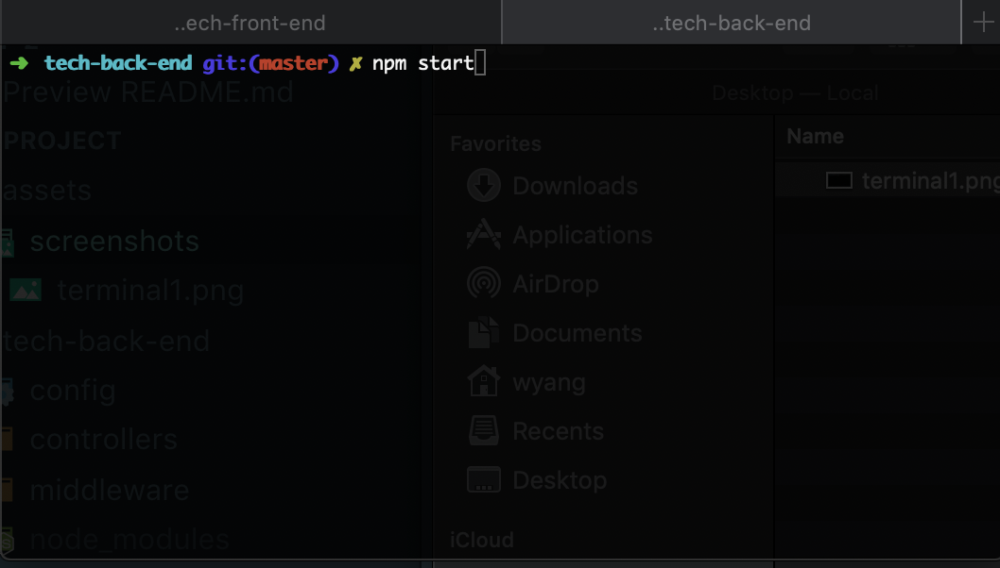
  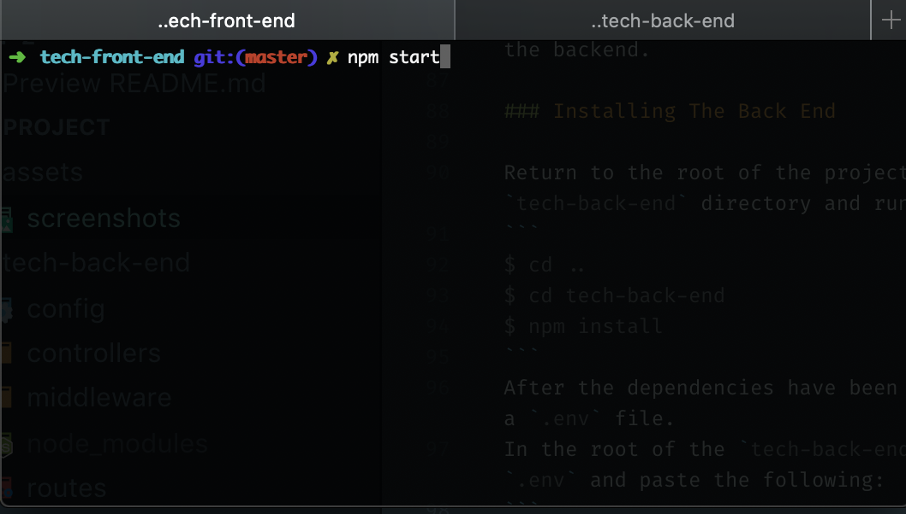
</p>

Run `npm start` with the `tech-back-end` first and then run `npm start` with `tech-front-end` once the back-end finishes starting up.

To confirm the backend has started, you should see something similar to the following with no errors:

```
[nodemon] 1.18.5
[nodemon] to restart at any time, enter `rs`
[nodemon] watching: *.*
[nodemon] starting `node server.js`
Server running on port: 5000
```

To confirm the frontend has started, you should be greeted with this screen.

<p align="center">
  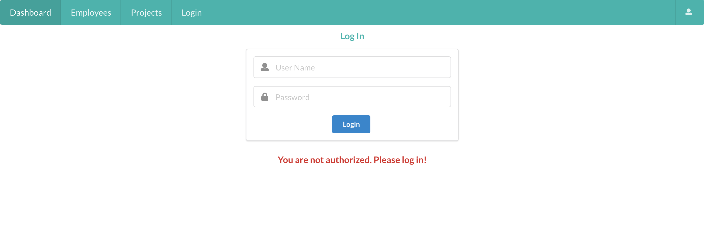
</p>

## Using Project Tracker

To login, use admin/password as the login credentials. If login is successful, you will be greeted with the dashboard.

<p align="center">
  
</p>

You can go to the **Employees** tab and add and employee to the database. 

<p align="center">
  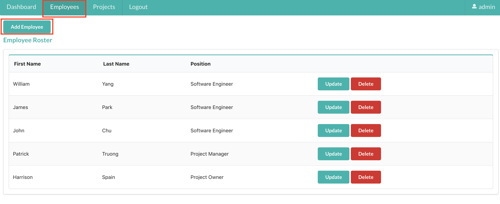
</p>

<p align="center">
  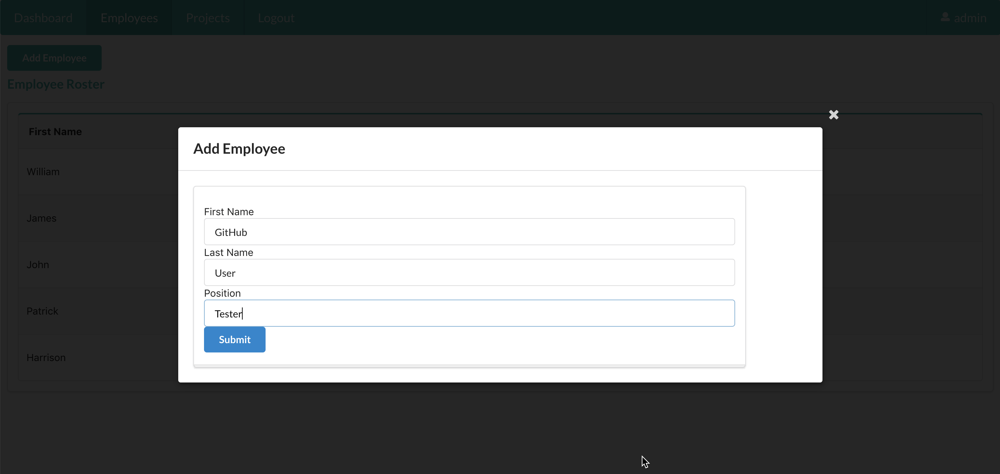
</p>

Once you have added your employee, you can go to the **Projects** tab to add a project.

<p align="center">
  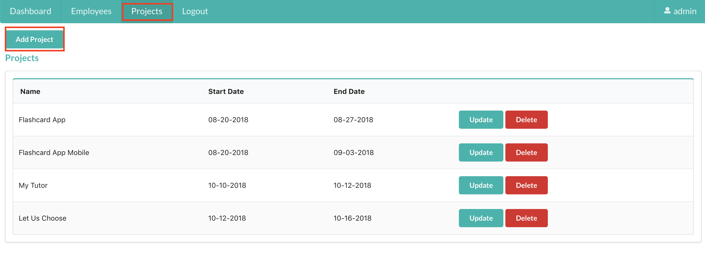
</p>

<p align="center">
  
</p>

Once you have added the project, you can click on the project name to view the **Project Details**.

<p align="center">
  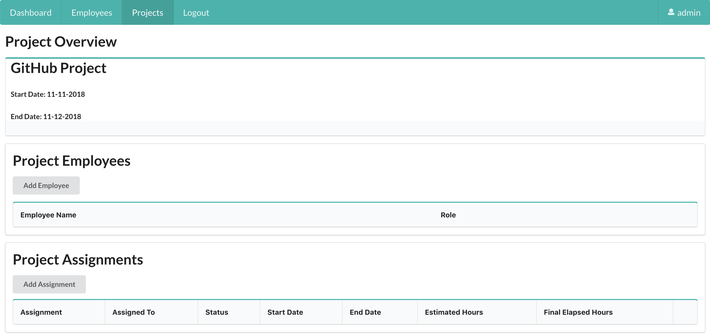
</p>

Here, you can add your newly created employee to the project.

<p align="center">
  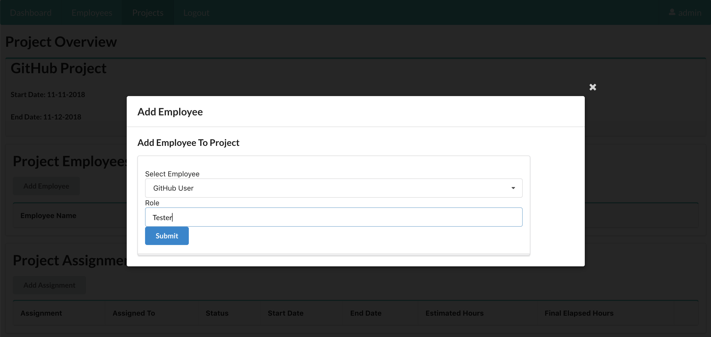
</p>

You can also add an assignment to your employee on this page as well.

<p align="center">
  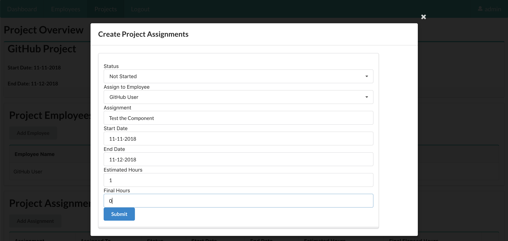
</p>

Once you have added these, you can click onto your employee's name to view the **employee details**.

<p align="center">
  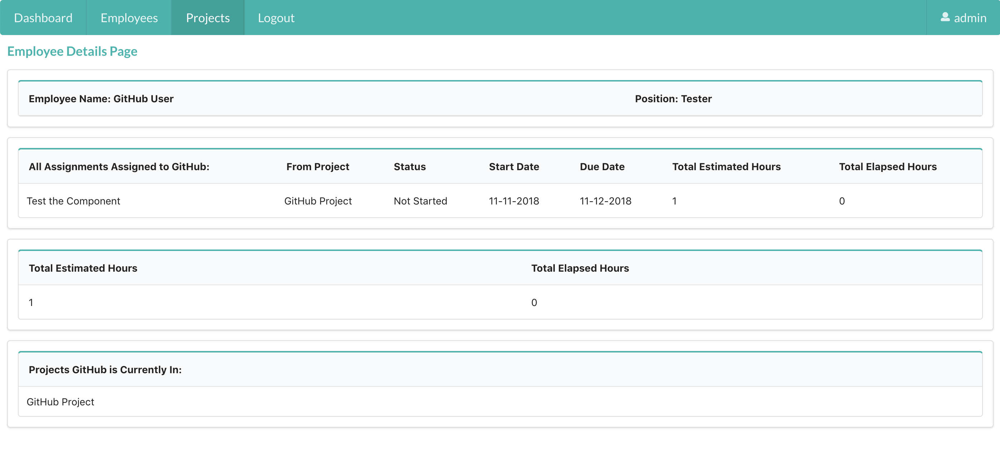
</p>

If you need to **update** or **delete** the assignment, you can either click on the assignment name, or return to the **project details** page to see the **update** and **delete** button.

<p align="center">
  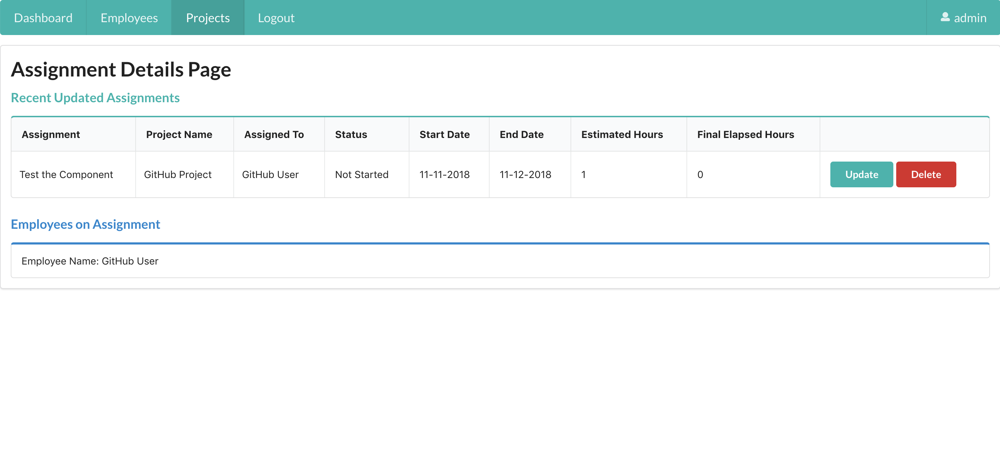
</p>

If there is an assignment that went over the employee's estimated time, it will show up on the dashboard. Additionally, any assignments that are blocked will show up on the dashboard as well.

<p align="center">
  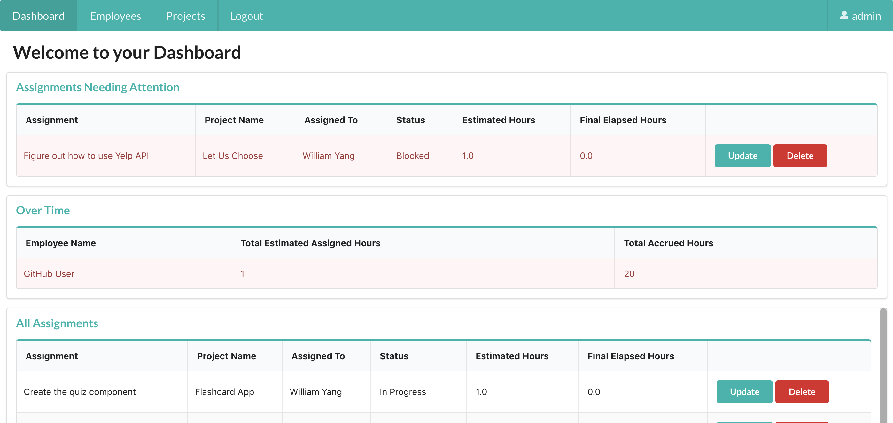
</p>

## Built With

* [React.js](https://reactjs.org/) 
* [Redux](https://redux.js.org/)
* [Semantic UI React](https://react.semantic-ui.com/)
* [Node.js](https://nodejs.org/en/) 
* [Express.js](https://expressjs.com/) 
* [bcryptjs](https://www.npmjs.com/package/bcryptjs)
* [jsonwebtoken](https://www.npmjs.com/package/jsonwebtoken)
* [passport-http](http://www.passportjs.org/docs/basic-digest/)
* [PostgreSQL](https://www.postgresql.org/) 
* [pg-promise](https://www.npmjs.com/package/pg-promise)


## Authors

* **William Yang** - *Initial work* - [m1771vw](https://github.com/m1771vw)
* **James Park**   - *Initial work* - [jaamz](https://github.com/jaamz)
* **John Chu**     - *Initial work* - [twmphoto](https://github.com/twmphoto)


## Contributors

You can look here for a list of [contributors](https://github.com/m1771vw/tech-project/graphs/contributors) for the project.